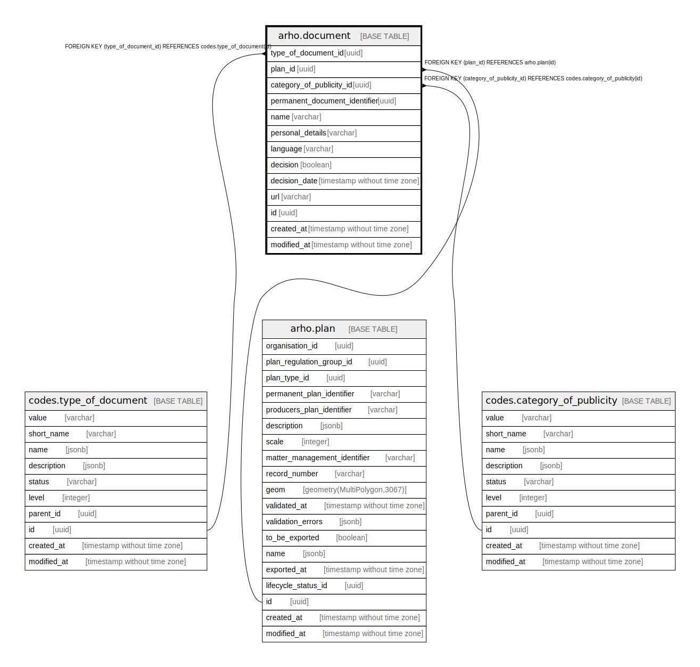

# arho.document

## Description

## Columns

| Name | Type | Default | Nullable | Children | Parents | Comment |
| ---- | ---- | ------- | -------- | -------- | ------- | ------- |
| type_of_document_id | uuid |  | false |  | [codes.type_of_document](codes.type_of_document.md) |  |
| plan_id | uuid |  | false |  | [arho.plan](arho.plan.md) |  |
| category_of_publicity_id | uuid |  | false |  | [codes.category_of_publicity](codes.category_of_publicity.md) |  |
| permanent_document_identifier | uuid |  | true |  |  |  |
| name | varchar |  | false |  |  |  |
| personal_details | varchar |  | false |  |  |  |
| language | varchar |  | false |  |  |  |
| decision | boolean |  | false |  |  |  |
| decision_date | timestamp without time zone | now() | true |  |  |  |
| url | varchar |  | true |  |  |  |
| id | uuid | gen_random_uuid() | false |  |  |  |
| created_at | timestamp without time zone | now() | false |  |  |  |
| modified_at | timestamp without time zone | now() | false |  |  |  |

## Viewpoints

| Name | Definition |
| ---- | ---------- |
| [All tables](viewpoint-0.md) | All tables that make up maakuntakaava plan data. |

## Constraints

| Name | Type | Definition |
| ---- | ---- | ---------- |
| category_of_publicity_id_fkey | FOREIGN KEY | FOREIGN KEY (category_of_publicity_id) REFERENCES codes.category_of_publicity(id) |
| type_of_document_id_fkey | FOREIGN KEY | FOREIGN KEY (type_of_document_id) REFERENCES codes.type_of_document(id) |
| plan_id_fkey | FOREIGN KEY | FOREIGN KEY (plan_id) REFERENCES arho.plan(id) |
| document_pkey | PRIMARY KEY | PRIMARY KEY (id) |

## Indexes

| Name | Definition |
| ---- | ---------- |
| document_pkey | CREATE UNIQUE INDEX document_pkey ON arho.document USING btree (id) |

## Triggers

| Name | Definition |
| ---- | ---------- |
| trg_document_modified_at | CREATE TRIGGER trg_document_modified_at BEFORE INSERT OR UPDATE ON arho.document FOR EACH ROW EXECUTE FUNCTION arho.trgfunc_modified_at() |

## Relations

---

> Generated by [tbls](https://github.com/k1LoW/tbls)
