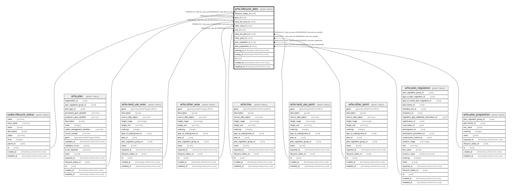

# arho.lifecycle_date

## Description

## Columns

| Name | Type | Default | Nullable | Children | Parents | Comment |
| ---- | ---- | ------- | -------- | -------- | ------- | ------- |
| lifecycle_status_id | uuid |  | false |  | [codes.lifecycle_status](codes.lifecycle_status.md) |  |
| plan_id | uuid |  | true |  | [arho.plan](arho.plan.md) |  |
| land_use_area_id | uuid |  | true |  | [arho.land_use_area](arho.land_use_area.md) |  |
| other_area_id | uuid |  | true |  | [arho.other_area](arho.other_area.md) |  |
| line_id | uuid |  | true |  | [arho.line](arho.line.md) |  |
| land_use_point_id | uuid |  | true |  | [arho.land_use_point](arho.land_use_point.md) |  |
| other_point_id | uuid |  | true |  | [arho.other_point](arho.other_point.md) |  |
| plan_regulation_id | uuid |  | true |  | [arho.plan_regulation](arho.plan_regulation.md) |  |
| plan_proposition_id | uuid |  | true |  | [arho.plan_proposition](arho.plan_proposition.md) |  |
| starting_at | timestamp without time zone |  | true |  |  |  |
| ending_at | timestamp without time zone |  | true |  |  |  |
| id | uuid | gen_random_uuid() | false |  |  |  |
| created_at | timestamp without time zone | now() | false |  |  |  |
| modified_at | timestamp without time zone | now() | false |  |  |  |

## Viewpoints

| Name | Definition |
| ---- | ---------- |
| [All tables](viewpoint-0.md) | All tables that make up maakuntakaava plan data. |

## Constraints

| Name | Type | Definition |
| ---- | ---- | ---------- |
| plan_lifecycle_status_id_fkey | FOREIGN KEY | FOREIGN KEY (lifecycle_status_id) REFERENCES codes.lifecycle_status(id) |
| plan_id_fkey | FOREIGN KEY | FOREIGN KEY (plan_id) REFERENCES arho.plan(id) |
| plan_proposition_id_fkey | FOREIGN KEY | FOREIGN KEY (plan_proposition_id) REFERENCES arho.plan_proposition(id) |
| plan_regulation_id_fkey | FOREIGN KEY | FOREIGN KEY (plan_regulation_id) REFERENCES arho.plan_regulation(id) |
| land_use_area_id_fkey | FOREIGN KEY | FOREIGN KEY (land_use_area_id) REFERENCES arho.land_use_area(id) |
| land_use_point_id_fkey | FOREIGN KEY | FOREIGN KEY (land_use_point_id) REFERENCES arho.land_use_point(id) |
| line_id_fkey | FOREIGN KEY | FOREIGN KEY (line_id) REFERENCES arho.line(id) |
| other_area_id_fkey | FOREIGN KEY | FOREIGN KEY (other_area_id) REFERENCES arho.other_area(id) |
| other_point_id_fkey | FOREIGN KEY | FOREIGN KEY (other_point_id) REFERENCES arho.other_point(id) |
| lifecycle_date_pkey | PRIMARY KEY | PRIMARY KEY (id) |

## Indexes

| Name | Definition |
| ---- | ---------- |
| lifecycle_date_pkey | CREATE UNIQUE INDEX lifecycle_date_pkey ON arho.lifecycle_date USING btree (id) |
| ix_arho_lifecycle_date_lifecycle_status_id | CREATE INDEX ix_arho_lifecycle_date_lifecycle_status_id ON arho.lifecycle_date USING btree (lifecycle_status_id) |

## Triggers

| Name | Definition |
| ---- | ---------- |
| trg_lifecycle_date_modified_at | CREATE TRIGGER trg_lifecycle_date_modified_at BEFORE INSERT OR UPDATE ON arho.lifecycle_date FOR EACH ROW EXECUTE FUNCTION arho.trgfunc_modified_at() |

## Relations

---

> Generated by [tbls](https://github.com/k1LoW/tbls)
