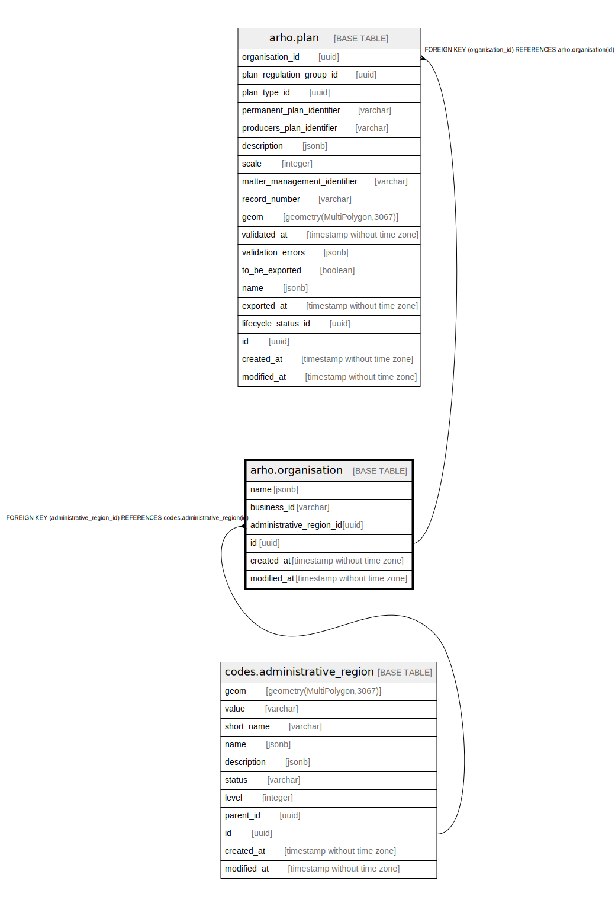

# arho.organisation

## Description

## Columns

| Name | Type | Default | Nullable | Children | Parents | Comment |
| ---- | ---- | ------- | -------- | -------- | ------- | ------- |
| name | jsonb | '{"eng": "", "fin": "", "swe": ""}'::jsonb | false |  |  |  |
| business_id | varchar |  | false |  |  |  |
| administrative_region_id | uuid |  | false |  | [codes.administrative_region](codes.administrative_region.md) |  |
| id | uuid | gen_random_uuid() | false | [arho.plan](arho.plan.md) |  |  |
| created_at | timestamp without time zone | now() | false |  |  |  |
| modified_at | timestamp without time zone | now() | false |  |  |  |

## Viewpoints

| Name | Definition |
| ---- | ---------- |
| [All tables](viewpoint-0.md) | All tables that make up maakuntakaava plan data. |

## Constraints

| Name | Type | Definition |
| ---- | ---- | ---------- |
| administrative_region_id_fkey | FOREIGN KEY | FOREIGN KEY (administrative_region_id) REFERENCES codes.administrative_region(id) |
| organisation_pkey | PRIMARY KEY | PRIMARY KEY (id) |

## Indexes

| Name | Definition |
| ---- | ---------- |
| organisation_pkey | CREATE UNIQUE INDEX organisation_pkey ON arho.organisation USING btree (id) |

## Triggers

| Name | Definition |
| ---- | ---------- |
| trg_organisation_modified_at | CREATE TRIGGER trg_organisation_modified_at BEFORE INSERT OR UPDATE ON arho.organisation FOR EACH ROW EXECUTE FUNCTION arho.trgfunc_modified_at() |

## Relations

---

> Generated by [tbls](https://github.com/k1LoW/tbls)
