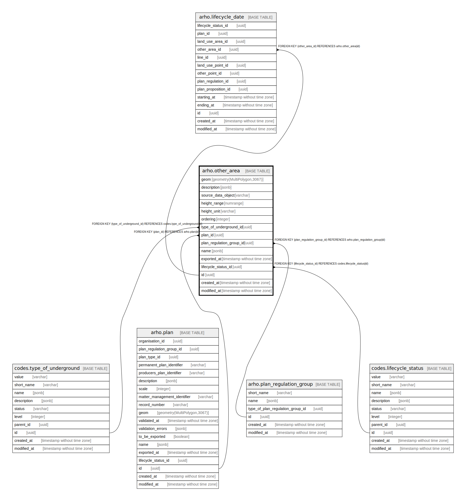

# arho.other_area

## Description

## Columns

| Name | Type | Default | Nullable | Children | Parents | Comment |
| ---- | ---- | ------- | -------- | -------- | ------- | ------- |
| geom | geometry(MultiPolygon,3067) |  | false |  |  |  |
| description | jsonb | '{"eng": "", "fin": "", "swe": ""}'::jsonb | false |  |  |  |
| source_data_object | varchar |  | true |  |  |  |
| height_range | numrange |  | true |  |  |  |
| height_unit | varchar |  | true |  |  |  |
| ordering | integer |  | true |  |  |  |
| type_of_underground_id | uuid |  | false |  | [codes.type_of_underground](codes.type_of_underground.md) |  |
| plan_id | uuid |  | true |  | [arho.plan](arho.plan.md) |  |
| plan_regulation_group_id | uuid |  | false |  | [arho.plan_regulation_group](arho.plan_regulation_group.md) |  |
| name | jsonb | '{"eng": "", "fin": "", "swe": ""}'::jsonb | false |  |  |  |
| exported_at | timestamp without time zone |  | true |  |  |  |
| lifecycle_status_id | uuid |  | false |  | [codes.lifecycle_status](codes.lifecycle_status.md) |  |
| id | uuid | gen_random_uuid() | false | [arho.lifecycle_date](arho.lifecycle_date.md) |  |  |
| created_at | timestamp without time zone | now() | false |  |  |  |
| modified_at | timestamp without time zone | now() | false |  |  |  |

## Viewpoints

| Name | Definition |
| ---- | ---------- |
| [All tables](viewpoint-0.md) | All tables that make up maakuntakaava plan data. |

## Constraints

| Name | Type | Definition |
| ---- | ---- | ---------- |
| plan_lifecycle_status_id_fkey | FOREIGN KEY | FOREIGN KEY (lifecycle_status_id) REFERENCES codes.lifecycle_status(id) |
| type_of_underground_id_fkey | FOREIGN KEY | FOREIGN KEY (type_of_underground_id) REFERENCES codes.type_of_underground(id) |
| plan_regulation_group_id_fkey | FOREIGN KEY | FOREIGN KEY (plan_regulation_group_id) REFERENCES arho.plan_regulation_group(id) |
| plan_id_fkey | FOREIGN KEY | FOREIGN KEY (plan_id) REFERENCES arho.plan(id) |
| other_area_pkey | PRIMARY KEY | PRIMARY KEY (id) |

## Indexes

| Name | Definition |
| ---- | ---------- |
| other_area_pkey | CREATE UNIQUE INDEX other_area_pkey ON arho.other_area USING btree (id) |
| idx_other_area_geom | CREATE INDEX idx_other_area_geom ON arho.other_area USING gist (geom) |
| ix_arho_other_area_lifecycle_status_id | CREATE INDEX ix_arho_other_area_lifecycle_status_id ON arho.other_area USING btree (lifecycle_status_id) |
| ix_arho_other_area_ordering | CREATE INDEX ix_arho_other_area_ordering ON arho.other_area USING btree (ordering) |
| ix_arho_other_area_plan_id | CREATE INDEX ix_arho_other_area_plan_id ON arho.other_area USING btree (plan_id) |
| ix_arho_other_area_plan_regulation_group_id | CREATE INDEX ix_arho_other_area_plan_regulation_group_id ON arho.other_area USING btree (plan_regulation_group_id) |
| ix_arho_other_area_type_of_underground_id | CREATE INDEX ix_arho_other_area_type_of_underground_id ON arho.other_area USING btree (type_of_underground_id) |

## Triggers

| Name | Definition |
| ---- | ---------- |
| trg_other_area_add_plan_id_fkey | CREATE TRIGGER trg_other_area_add_plan_id_fkey BEFORE INSERT ON arho.other_area FOR EACH ROW EXECUTE FUNCTION arho.trgfunc_add_plan_id_fkey() |
| trg_other_area_insert_intersecting_geometries | CREATE TRIGGER trg_other_area_insert_intersecting_geometries BEFORE INSERT ON arho.other_area FOR EACH ROW EXECUTE FUNCTION arho.trgfunc_other_area_insert_intersecting_geometries() |
| trg_other_area_modified_at | CREATE TRIGGER trg_other_area_modified_at BEFORE INSERT OR UPDATE ON arho.other_area FOR EACH ROW EXECUTE FUNCTION arho.trgfunc_modified_at() |
| trg_other_area_new_lifecycle_date | CREATE TRIGGER trg_other_area_new_lifecycle_date BEFORE UPDATE ON arho.other_area FOR EACH ROW WHEN ((new.lifecycle_status_id <> old.lifecycle_status_id)) EXECUTE FUNCTION arho.trgfunc_other_area_new_lifecycle_date() |
| trg_other_area_new_lifecycle_status | CREATE TRIGGER trg_other_area_new_lifecycle_status BEFORE INSERT ON arho.other_area FOR EACH ROW WHEN ((new.plan_id IS NOT NULL)) EXECUTE FUNCTION arho.trgfunc_other_area_new_lifecycle_status() |
| trg_other_area_plan_proposition_update_lifecycle_status | CREATE TRIGGER trg_other_area_plan_proposition_update_lifecycle_status BEFORE UPDATE ON arho.other_area FOR EACH ROW WHEN ((new.lifecycle_status_id <> old.lifecycle_status_id)) EXECUTE FUNCTION arho.trgfunc_other_area_plan_proposition_update_lifecycle_status() |
| trg_other_area_plan_regulation_update_lifecycle_status | CREATE TRIGGER trg_other_area_plan_regulation_update_lifecycle_status BEFORE UPDATE ON arho.other_area FOR EACH ROW WHEN ((new.lifecycle_status_id <> old.lifecycle_status_id)) EXECUTE FUNCTION arho.trgfunc_other_area_plan_regulation_update_lifecycle_status() |
| trg_other_area_validate_polygon_geometry | CREATE TRIGGER trg_other_area_validate_polygon_geometry BEFORE INSERT OR UPDATE ON arho.other_area FOR EACH ROW EXECUTE FUNCTION arho.trgfunc_validate_polygon_geometry() |

## Relations

---

> Generated by [tbls](https://github.com/k1LoW/tbls)
