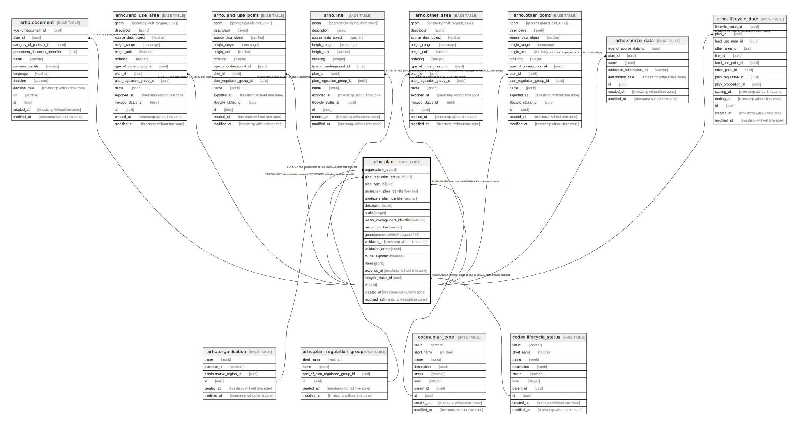

# arho.plan

## Description

## Columns

| Name | Type | Default | Nullable | Children | Parents | Comment |
| ---- | ---- | ------- | -------- | -------- | ------- | ------- |
| organisation_id | uuid |  | false |  | [arho.organisation](arho.organisation.md) |  |
| plan_regulation_group_id | uuid |  | true |  | [arho.plan_regulation_group](arho.plan_regulation_group.md) |  |
| plan_type_id | uuid |  | false |  | [codes.plan_type](codes.plan_type.md) |  |
| permanent_plan_identifier | varchar |  | true |  |  |  |
| producers_plan_identifier | varchar |  | true |  |  |  |
| description | jsonb | '{"eng": "", "fin": "", "swe": ""}'::jsonb | false |  |  |  |
| scale | integer |  | true |  |  |  |
| matter_management_identifier | varchar |  | true |  |  |  |
| record_number | varchar |  | true |  |  |  |
| geom | geometry(MultiPolygon,3067) |  | false |  |  |  |
| validated_at | timestamp without time zone |  | true |  |  |  |
| validation_errors | jsonb |  | true |  |  |  |
| to_be_exported | boolean | false | false |  |  |  |
| name | jsonb | '{"eng": "", "fin": "", "swe": ""}'::jsonb | false |  |  |  |
| exported_at | timestamp without time zone |  | true |  |  |  |
| lifecycle_status_id | uuid |  | false |  | [codes.lifecycle_status](codes.lifecycle_status.md) |  |
| id | uuid | gen_random_uuid() | false | [arho.document](arho.document.md) [arho.land_use_area](arho.land_use_area.md) [arho.land_use_point](arho.land_use_point.md) [arho.line](arho.line.md) [arho.other_area](arho.other_area.md) [arho.other_point](arho.other_point.md) [arho.source_data](arho.source_data.md) [arho.lifecycle_date](arho.lifecycle_date.md) |  |  |
| created_at | timestamp without time zone | now() | false |  |  |  |
| modified_at | timestamp without time zone | now() | false |  |  |  |

## Viewpoints

| Name | Definition |
| ---- | ---------- |
| [All tables](viewpoint-0.md) | All tables that make up maakuntakaava plan data. |

## Constraints

| Name | Type | Definition |
| ---- | ---- | ---------- |
| plan_lifecycle_status_id_fkey | FOREIGN KEY | FOREIGN KEY (lifecycle_status_id) REFERENCES codes.lifecycle_status(id) |
| plan_type_id_fkey | FOREIGN KEY | FOREIGN KEY (plan_type_id) REFERENCES codes.plan_type(id) |
| organisation_id_fkey | FOREIGN KEY | FOREIGN KEY (organisation_id) REFERENCES arho.organisation(id) |
| plan_regulation_group_id_fkey | FOREIGN KEY | FOREIGN KEY (plan_regulation_group_id) REFERENCES arho.plan_regulation_group(id) |
| plan_pkey | PRIMARY KEY | PRIMARY KEY (id) |

## Indexes

| Name | Definition |
| ---- | ---------- |
| plan_pkey | CREATE UNIQUE INDEX plan_pkey ON arho.plan USING btree (id) |
| idx_plan_geom | CREATE INDEX idx_plan_geom ON arho.plan USING gist (geom) |
| ix_arho_plan_lifecycle_status_id | CREATE INDEX ix_arho_plan_lifecycle_status_id ON arho.plan USING btree (lifecycle_status_id) |

## Triggers

| Name | Definition |
| ---- | ---------- |
| trg_plan_modified_at | CREATE TRIGGER trg_plan_modified_at BEFORE INSERT OR UPDATE ON arho.plan FOR EACH ROW EXECUTE FUNCTION arho.trgfunc_modified_at() |
| trg_plan_new_lifecycle_date | CREATE TRIGGER trg_plan_new_lifecycle_date BEFORE UPDATE ON arho.plan FOR EACH ROW WHEN ((new.lifecycle_status_id <> old.lifecycle_status_id)) EXECUTE FUNCTION arho.trgfunc_plan_new_lifecycle_date() |
| trg_land_use_area_update_lifecycle_status | CREATE TRIGGER trg_land_use_area_update_lifecycle_status BEFORE UPDATE ON arho.plan FOR EACH ROW WHEN ((new.lifecycle_status_id <> old.lifecycle_status_id)) EXECUTE FUNCTION arho.trgfunc_land_use_area_update_lifecycle_status() |
| trg_land_use_point_update_lifecycle_status | CREATE TRIGGER trg_land_use_point_update_lifecycle_status BEFORE UPDATE ON arho.plan FOR EACH ROW WHEN ((new.lifecycle_status_id <> old.lifecycle_status_id)) EXECUTE FUNCTION arho.trgfunc_land_use_point_update_lifecycle_status() |
| trg_line_update_lifecycle_status | CREATE TRIGGER trg_line_update_lifecycle_status BEFORE UPDATE ON arho.plan FOR EACH ROW WHEN ((new.lifecycle_status_id <> old.lifecycle_status_id)) EXECUTE FUNCTION arho.trgfunc_line_update_lifecycle_status() |
| trg_other_area_update_lifecycle_status | CREATE TRIGGER trg_other_area_update_lifecycle_status BEFORE UPDATE ON arho.plan FOR EACH ROW WHEN ((new.lifecycle_status_id <> old.lifecycle_status_id)) EXECUTE FUNCTION arho.trgfunc_other_area_update_lifecycle_status() |
| trg_other_point_update_lifecycle_status | CREATE TRIGGER trg_other_point_update_lifecycle_status BEFORE UPDATE ON arho.plan FOR EACH ROW WHEN ((new.lifecycle_status_id <> old.lifecycle_status_id)) EXECUTE FUNCTION arho.trgfunc_other_point_update_lifecycle_status() |
| trg_plan_plan_regulation_update_lifecycle_status | CREATE TRIGGER trg_plan_plan_regulation_update_lifecycle_status BEFORE UPDATE ON arho.plan FOR EACH ROW WHEN ((new.lifecycle_status_id <> old.lifecycle_status_id)) EXECUTE FUNCTION arho.trgfunc_plan_plan_regulation_update_lifecycle_status() |
| trg_plan_plan_proposition_update_lifecycle_status | CREATE TRIGGER trg_plan_plan_proposition_update_lifecycle_status BEFORE UPDATE ON arho.plan FOR EACH ROW WHEN ((new.lifecycle_status_id <> old.lifecycle_status_id)) EXECUTE FUNCTION arho.trgfunc_plan_plan_proposition_update_lifecycle_status() |
| trg_plan_validate_polygon_geometry | CREATE TRIGGER trg_plan_validate_polygon_geometry BEFORE INSERT OR UPDATE ON arho.plan FOR EACH ROW EXECUTE FUNCTION arho.trgfunc_validate_polygon_geometry() |

## Relations

---

> Generated by [tbls](https://github.com/k1LoW/tbls)
