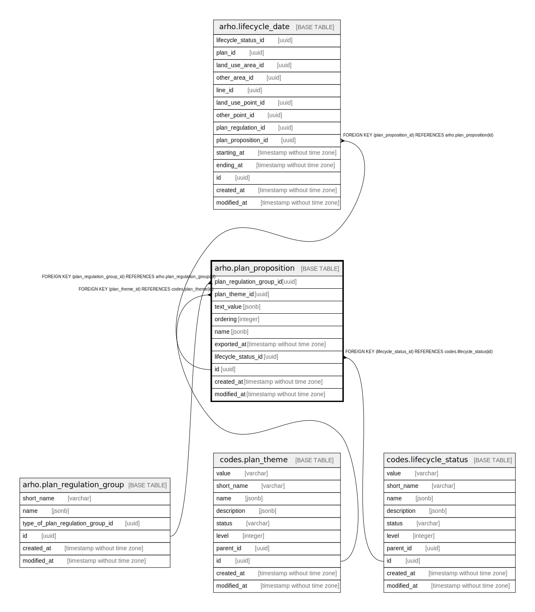

# arho.plan_proposition

## Description

## Columns

| Name | Type | Default | Nullable | Children | Parents | Comment |
| ---- | ---- | ------- | -------- | -------- | ------- | ------- |
| plan_regulation_group_id | uuid |  | false |  | [arho.plan_regulation_group](arho.plan_regulation_group.md) |  |
| plan_theme_id | uuid |  | true |  | [codes.plan_theme](codes.plan_theme.md) |  |
| text_value | jsonb | '{"eng": "", "fin": "", "swe": ""}'::jsonb | false |  |  |  |
| ordering | integer |  | true |  |  |  |
| name | jsonb | '{"eng": "", "fin": "", "swe": ""}'::jsonb | false |  |  |  |
| exported_at | timestamp without time zone |  | true |  |  |  |
| lifecycle_status_id | uuid |  | false |  | [codes.lifecycle_status](codes.lifecycle_status.md) |  |
| id | uuid | gen_random_uuid() | false | [arho.lifecycle_date](arho.lifecycle_date.md) |  |  |
| created_at | timestamp without time zone | now() | false |  |  |  |
| modified_at | timestamp without time zone | now() | false |  |  |  |

## Viewpoints

| Name | Definition |
| ---- | ---------- |
| [All tables](viewpoint-0.md) | All tables that make up maakuntakaava plan data. |

## Constraints

| Name | Type | Definition |
| ---- | ---- | ---------- |
| plan_lifecycle_status_id_fkey | FOREIGN KEY | FOREIGN KEY (lifecycle_status_id) REFERENCES codes.lifecycle_status(id) |
| plan_theme_id_fkey | FOREIGN KEY | FOREIGN KEY (plan_theme_id) REFERENCES codes.plan_theme(id) |
| plan_regulation_group_id_fkey | FOREIGN KEY | FOREIGN KEY (plan_regulation_group_id) REFERENCES arho.plan_regulation_group(id) |
| plan_proposition_pkey | PRIMARY KEY | PRIMARY KEY (id) |

## Indexes

| Name | Definition |
| ---- | ---------- |
| plan_proposition_pkey | CREATE UNIQUE INDEX plan_proposition_pkey ON arho.plan_proposition USING btree (id) |
| ix_arho_plan_proposition_lifecycle_status_id | CREATE INDEX ix_arho_plan_proposition_lifecycle_status_id ON arho.plan_proposition USING btree (lifecycle_status_id) |
| ix_arho_plan_proposition_ordering | CREATE INDEX ix_arho_plan_proposition_ordering ON arho.plan_proposition USING btree (ordering) |

## Triggers

| Name | Definition |
| ---- | ---------- |
| trg_plan_proposition_modified_at | CREATE TRIGGER trg_plan_proposition_modified_at BEFORE INSERT OR UPDATE ON arho.plan_proposition FOR EACH ROW EXECUTE FUNCTION arho.trgfunc_modified_at() |
| trg_plan_proposition_new_lifecycle_date | CREATE TRIGGER trg_plan_proposition_new_lifecycle_date BEFORE UPDATE ON arho.plan_proposition FOR EACH ROW WHEN ((new.lifecycle_status_id <> old.lifecycle_status_id)) EXECUTE FUNCTION arho.trgfunc_plan_proposition_new_lifecycle_date() |
| trg_plan_proposition_land_use_area_new_lifecycle_status | CREATE TRIGGER trg_plan_proposition_land_use_area_new_lifecycle_status BEFORE INSERT ON arho.plan_proposition FOR EACH ROW EXECUTE FUNCTION arho.trgfunc_plan_proposition_land_use_area_new_lifecycle_status() |
| trg_plan_proposition_land_use_point_new_lifecycle_status | CREATE TRIGGER trg_plan_proposition_land_use_point_new_lifecycle_status BEFORE INSERT ON arho.plan_proposition FOR EACH ROW EXECUTE FUNCTION arho.trgfunc_plan_proposition_land_use_point_new_lifecycle_status() |
| trg_plan_proposition_line_new_lifecycle_status | CREATE TRIGGER trg_plan_proposition_line_new_lifecycle_status BEFORE INSERT ON arho.plan_proposition FOR EACH ROW EXECUTE FUNCTION arho.trgfunc_plan_proposition_line_new_lifecycle_status() |
| trg_plan_proposition_other_area_new_lifecycle_status | CREATE TRIGGER trg_plan_proposition_other_area_new_lifecycle_status BEFORE INSERT ON arho.plan_proposition FOR EACH ROW EXECUTE FUNCTION arho.trgfunc_plan_proposition_other_area_new_lifecycle_status() |
| trg_plan_proposition_other_point_new_lifecycle_status | CREATE TRIGGER trg_plan_proposition_other_point_new_lifecycle_status BEFORE INSERT ON arho.plan_proposition FOR EACH ROW EXECUTE FUNCTION arho.trgfunc_plan_proposition_other_point_new_lifecycle_status() |
| trg_plan_proposition_plan_new_lifecycle_status | CREATE TRIGGER trg_plan_proposition_plan_new_lifecycle_status BEFORE INSERT ON arho.plan_proposition FOR EACH ROW EXECUTE FUNCTION arho.trgfunc_plan_proposition_plan_new_lifecycle_status() |

## Relations

---

> Generated by [tbls](https://github.com/k1LoW/tbls)
