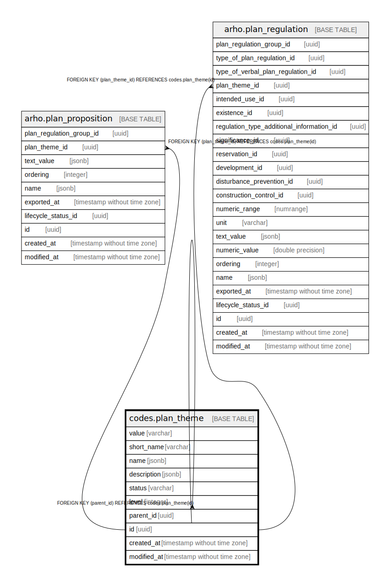

# codes.plan_theme

## Description

## Columns

| Name | Type | Default | Nullable | Children | Parents | Comment |
| ---- | ---- | ------- | -------- | -------- | ------- | ------- |
| value | varchar |  | false |  |  |  |
| short_name | varchar | ''::character varying | false |  |  |  |
| name | jsonb | '{"eng": "", "fin": "", "swe": ""}'::jsonb | false |  |  |  |
| description | jsonb | '{"eng": "", "fin": "", "swe": ""}'::jsonb | false |  |  |  |
| status | varchar |  | false |  |  |  |
| level | integer | 1 | false |  |  |  |
| parent_id | uuid |  | true |  | [codes.plan_theme](codes.plan_theme.md) |  |
| id | uuid | gen_random_uuid() | false | [hame.plan_regulation](hame.plan_regulation.md) [hame.plan_proposition](hame.plan_proposition.md) [codes.plan_theme](codes.plan_theme.md) |  |  |
| created_at | timestamp without time zone | now() | false |  |  |  |
| modified_at | timestamp without time zone | now() | false |  |  |  |

## Viewpoints

| Name | Definition |
| ---- | ---------- |
| [All tables](viewpoint-0.md) | All tables that make up maakuntakaava plan data. |

## Constraints

| Name | Type | Definition |
| ---- | ---- | ---------- |
| plan_theme_parent_id_fkey | FOREIGN KEY | FOREIGN KEY (parent_id) REFERENCES codes.plan_theme(id) |
| plan_theme_pkey | PRIMARY KEY | PRIMARY KEY (id) |

## Indexes

| Name | Definition |
| ---- | ---------- |
| plan_theme_pkey | CREATE UNIQUE INDEX plan_theme_pkey ON codes.plan_theme USING btree (id) |
| ix_codes_plan_theme_level | CREATE INDEX ix_codes_plan_theme_level ON codes.plan_theme USING btree (level) |
| ix_codes_plan_theme_parent_id | CREATE INDEX ix_codes_plan_theme_parent_id ON codes.plan_theme USING btree (parent_id) |
| ix_codes_plan_theme_short_name | CREATE INDEX ix_codes_plan_theme_short_name ON codes.plan_theme USING btree (short_name) |
| ix_codes_plan_theme_value | CREATE UNIQUE INDEX ix_codes_plan_theme_value ON codes.plan_theme USING btree (value) |

## Relations

---

> Generated by [tbls](https://github.com/k1LoW/tbls)
