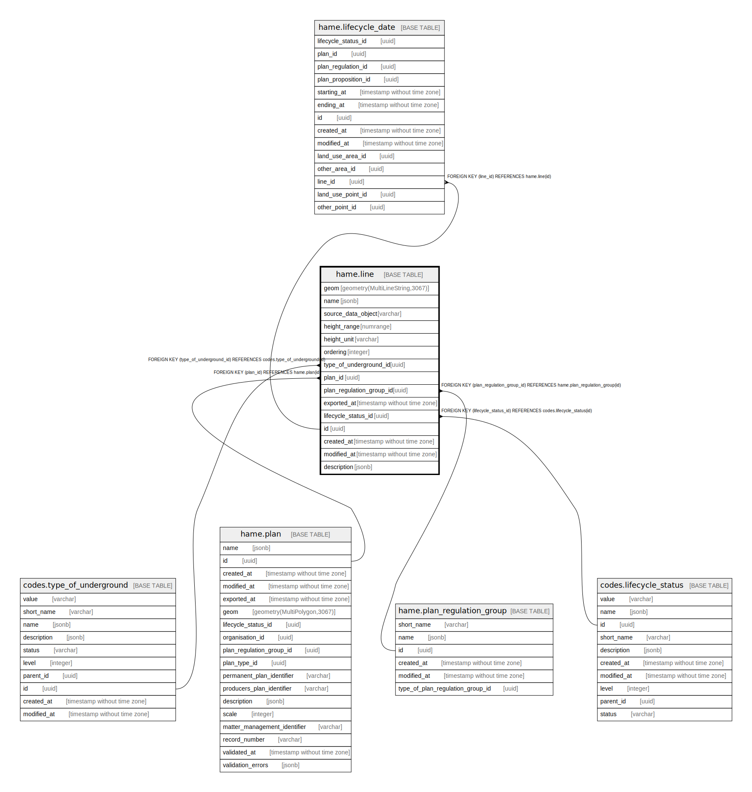

# hame.line

## Description

## Columns

| Name | Type | Default | Nullable | Children | Parents | Comment |
| ---- | ---- | ------- | -------- | -------- | ------- | ------- |
| geom | geometry(MultiLineString,3067) |  | false |  |  |  |
| name | jsonb | '{"eng": "", "fin": "", "swe": ""}'::jsonb | false |  |  |  |
| source_data_object | varchar |  | true |  |  |  |
| height_range | numrange |  | true |  |  |  |
| height_unit | varchar |  | true |  |  |  |
| ordering | integer |  | true |  |  |  |
| type_of_underground_id | uuid |  | false |  | [codes.type_of_underground](codes.type_of_underground.md) |  |
| plan_id | uuid |  | true |  | [hame.plan](hame.plan.md) |  |
| plan_regulation_group_id | uuid |  | false |  | [hame.plan_regulation_group](hame.plan_regulation_group.md) |  |
| exported_at | timestamp without time zone |  | true |  |  |  |
| lifecycle_status_id | uuid |  | false |  | [codes.lifecycle_status](codes.lifecycle_status.md) |  |
| id | uuid | gen_random_uuid() | false | [hame.lifecycle_date](hame.lifecycle_date.md) |  |  |
| created_at | timestamp without time zone | now() | false |  |  |  |
| modified_at | timestamp without time zone | now() | false |  |  |  |
| description | jsonb | '{"eng": "", "fin": "", "swe": ""}'::jsonb | false |  |  |  |

## Viewpoints

| Name | Definition |
| ---- | ---------- |
| [All tables](viewpoint-0.md) | All tables that make up maakuntakaava plan data. |

## Constraints

| Name | Type | Definition |
| ---- | ---- | ---------- |
| plan_id_fkey | FOREIGN KEY | FOREIGN KEY (plan_id) REFERENCES hame.plan(id) |
| plan_lifecycle_status_id_fkey | FOREIGN KEY | FOREIGN KEY (lifecycle_status_id) REFERENCES codes.lifecycle_status(id) |
| type_of_underground_id_fkey | FOREIGN KEY | FOREIGN KEY (type_of_underground_id) REFERENCES codes.type_of_underground(id) |
| plan_regulation_group_id_fkey | FOREIGN KEY | FOREIGN KEY (plan_regulation_group_id) REFERENCES hame.plan_regulation_group(id) |
| line_pkey | PRIMARY KEY | PRIMARY KEY (id) |

## Indexes

| Name | Definition |
| ---- | ---------- |
| line_pkey | CREATE UNIQUE INDEX line_pkey ON hame.line USING btree (id) |
| idx_line_geom | CREATE INDEX idx_line_geom ON hame.line USING gist (geom) |
| ix_hame_line_lifecycle_status_id | CREATE INDEX ix_hame_line_lifecycle_status_id ON hame.line USING btree (lifecycle_status_id) |
| ix_hame_line_ordering | CREATE INDEX ix_hame_line_ordering ON hame.line USING btree (ordering) |
| ix_hame_line_plan_id | CREATE INDEX ix_hame_line_plan_id ON hame.line USING btree (plan_id) |
| ix_hame_line_plan_regulation_group_id | CREATE INDEX ix_hame_line_plan_regulation_group_id ON hame.line USING btree (plan_regulation_group_id) |
| ix_hame_line_type_of_underground_id | CREATE INDEX ix_hame_line_type_of_underground_id ON hame.line USING btree (type_of_underground_id) |

## Triggers

| Name | Definition |
| ---- | ---------- |
| trg_line_modified_at | CREATE TRIGGER trg_line_modified_at BEFORE INSERT OR UPDATE ON hame.line FOR EACH ROW EXECUTE FUNCTION hame.trgfunc_modified_at() |
| trg_line_validate_geometry | CREATE TRIGGER trg_line_validate_geometry BEFORE INSERT OR UPDATE ON hame.line FOR EACH ROW EXECUTE FUNCTION hame.trgfunc_line_validate_geometry() |
| trg_line_new_lifecycle_date | CREATE TRIGGER trg_line_new_lifecycle_date BEFORE UPDATE ON hame.line FOR EACH ROW WHEN ((new.lifecycle_status_id <> old.lifecycle_status_id)) EXECUTE FUNCTION hame.trgfunc_line_new_lifecycle_date() |
| trg_line_add_plan_id_fkey | CREATE TRIGGER trg_line_add_plan_id_fkey BEFORE INSERT ON hame.line FOR EACH ROW EXECUTE FUNCTION hame.trgfunc_add_plan_id_fkey() |

## Relations

---

> Generated by [tbls](https://github.com/k1LoW/tbls)
