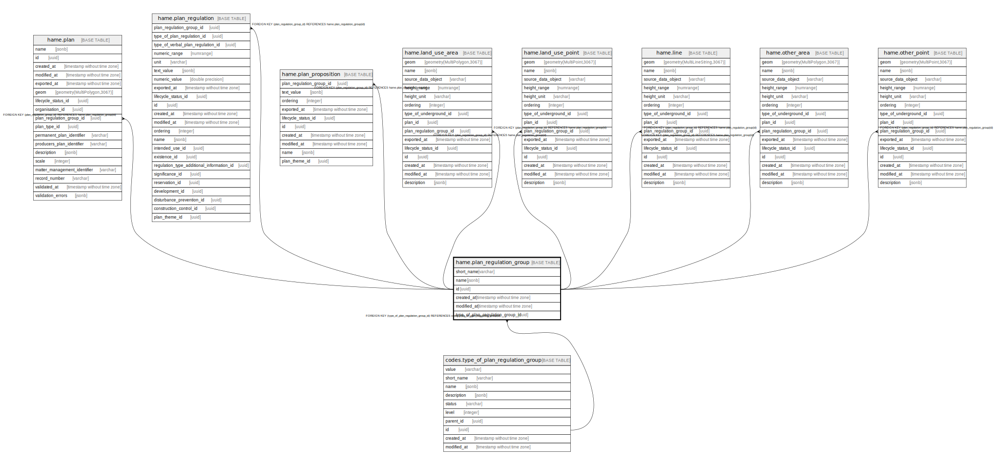

# hame.plan_regulation_group

## Description

## Columns

| Name | Type | Default | Nullable | Children | Parents | Comment |
| ---- | ---- | ------- | -------- | -------- | ------- | ------- |
| short_name | varchar |  | false |  |  |  |
| name | jsonb | '{"eng": "", "fin": "", "swe": ""}'::jsonb | false |  |  |  |
| id | uuid | gen_random_uuid() | false | [hame.plan](hame.plan.md) [hame.plan_regulation](hame.plan_regulation.md) [hame.plan_proposition](hame.plan_proposition.md) [hame.land_use_area](hame.land_use_area.md) [hame.land_use_point](hame.land_use_point.md) [hame.line](hame.line.md) [hame.other_area](hame.other_area.md) [hame.other_point](hame.other_point.md) |  |  |
| created_at | timestamp without time zone | now() | false |  |  |  |
| modified_at | timestamp without time zone | now() | false |  |  |  |
| type_of_plan_regulation_group_id | uuid |  | false |  | [codes.type_of_plan_regulation_group](codes.type_of_plan_regulation_group.md) |  |

## Viewpoints

| Name | Definition |
| ---- | ---------- |
| [All tables](viewpoint-0.md) | All tables that make up maakuntakaava plan data. |

## Constraints

| Name | Type | Definition |
| ---- | ---- | ---------- |
| plan_regulation_group_pkey | PRIMARY KEY | PRIMARY KEY (id) |
| type_of_plan_regulation_group_id_fkey | FOREIGN KEY | FOREIGN KEY (type_of_plan_regulation_group_id) REFERENCES codes.type_of_plan_regulation_group(id) |

## Indexes

| Name | Definition |
| ---- | ---------- |
| plan_regulation_group_pkey | CREATE UNIQUE INDEX plan_regulation_group_pkey ON hame.plan_regulation_group USING btree (id) |
| ix_hame_plan_regulation_group_short_name | CREATE UNIQUE INDEX ix_hame_plan_regulation_group_short_name ON hame.plan_regulation_group USING btree (short_name) |

## Triggers

| Name | Definition |
| ---- | ---------- |
| trg_plan_regulation_group_modified_at | CREATE TRIGGER trg_plan_regulation_group_modified_at BEFORE INSERT OR UPDATE ON hame.plan_regulation_group FOR EACH ROW EXECUTE FUNCTION hame.trgfunc_modified_at() |

## Relations

---

> Generated by [tbls](https://github.com/k1LoW/tbls)
